# 🚀 Rivalyze – AI Powered Competitive Intelligence Platform

> An AI-powered competitive intelligence platform developed during **SNUCHACKS Hackathon** that analyzes competitor websites and customer reviews to generate actionable business insights, identify market opportunities, and support strategic product planning.


---

## 🏆 Hackathon Project

This project was built as part of **SNUCHACKS Hackathon** by a team of four members.

Rivalyze was designed to help founders, startups, and product teams quickly understand their competitors using Artificial Intelligence and data-driven analysis.

---

## 👥 Team Members

- JOSHITHA PANYAM
- ANGELIN ANTO
- HARISH
- GRACIA


---

## 📌 Problem Statement

Understanding competitors is one of the most time-consuming parts of product development.

Businesses typically spend hours manually:

- Reading competitor websites
- Comparing pricing
- Going through customer reviews
- Identifying strengths and weaknesses
- Finding market gaps

Rivalyze automates this entire workflow using AI.

---

# ✨ Features

## 🔍 Competitor Website Analysis

- Extracts product information from competitor websites
- Identifies major features
- Finds pricing information
- Compares offerings across multiple competitors

---

## 💬 Customer Review Analysis

The platform analyzes customer reviews to determine:

- Positive sentiment
- Negative sentiment
- Frequently requested features
- Common complaints
- Customer satisfaction trends

---

## 📈 Market Intelligence

Generate valuable business insights including:

- Market overview
- Feature landscape
- Competitor positioning
- Emerging trends
- White-space opportunities

---

## 🤖 AI Powered Insights

Using AI, Rivalyze generates:

- Business recommendations
- Product improvement suggestions
- Competitive advantages
- Threat analysis
- Opportunity identification

---

## 📊 Interactive Dashboard

A centralized dashboard provides:

- Competitor comparison
- Market metrics
- Customer insights
- AI-generated recommendations
- Trend visualization

---

# 🛠 Tech Stack

### Frontend

- React.js
- Vite
- JavaScript
- Tailwind CSS

### AI & Data Processing

- Large Language Models (LLMs)
- Natural Language Processing (NLP)
- Sentiment Analysis

### APIs

- Web Search APIs
- Website Scraping
- AI Analysis Pipeline

---

# 📂 Project Structure

```
Rivalyze
│
├── src/
├── entities/
├── screenshots/
├── docs/
├── package.json
├── README.md
└── vite.config.js
```

---

# 📸 Application Screenshots

## Login Page

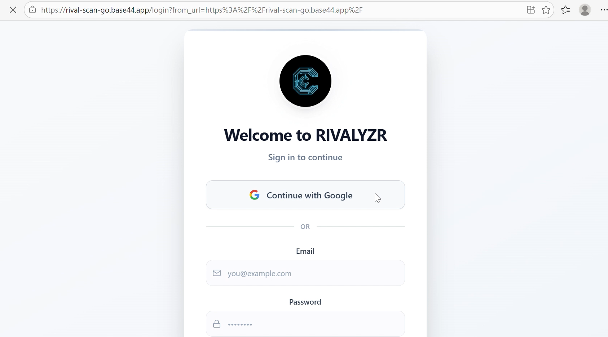

---

## Dashboard

### Dashboard Overview

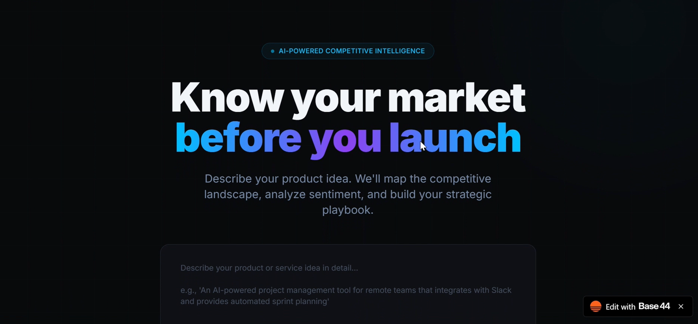

### Analytics Dashboard

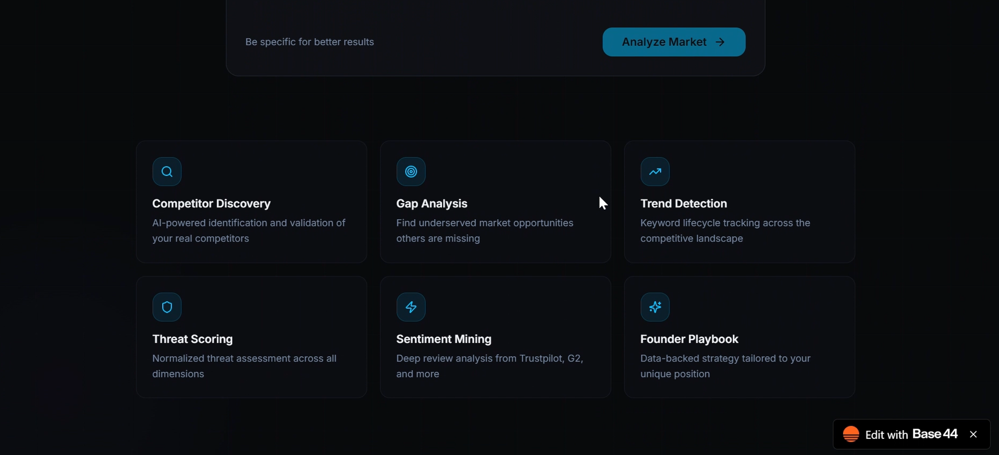

### Competitor Dashboard

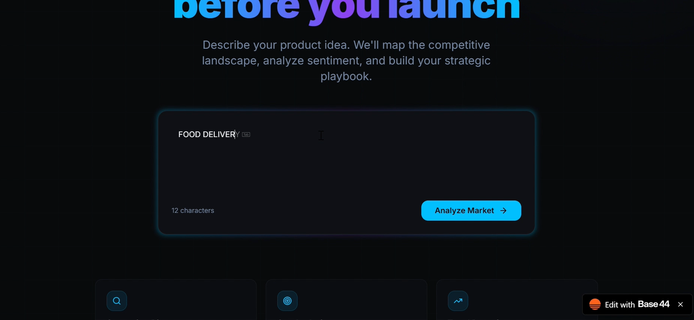

---

## Market Overview

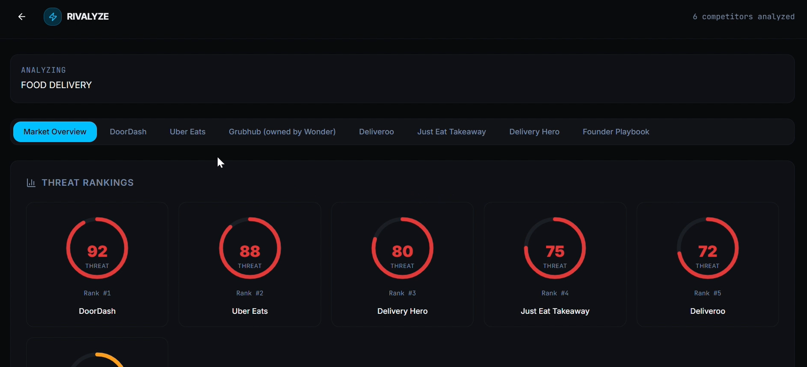

---

## Deep Search & Analysis

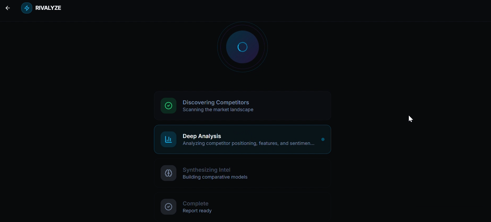

---

## Keyword Trends

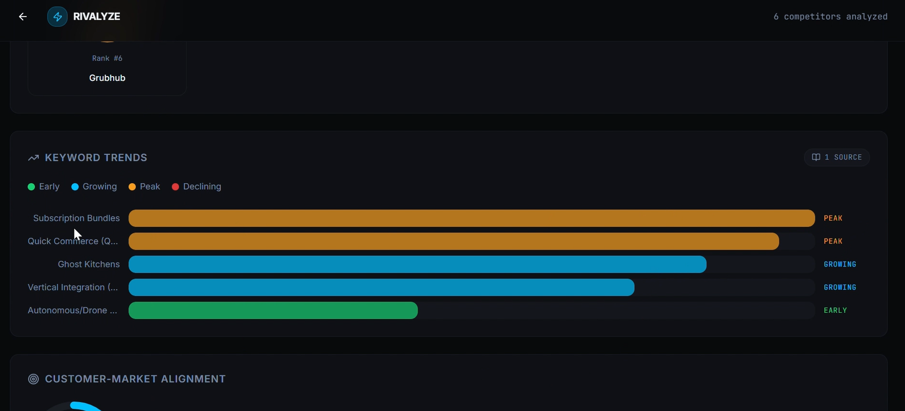

---

## DoorDash Analysis

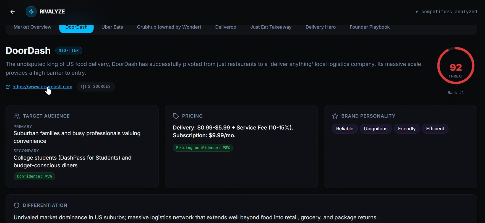

---

## DoorDash Official Links

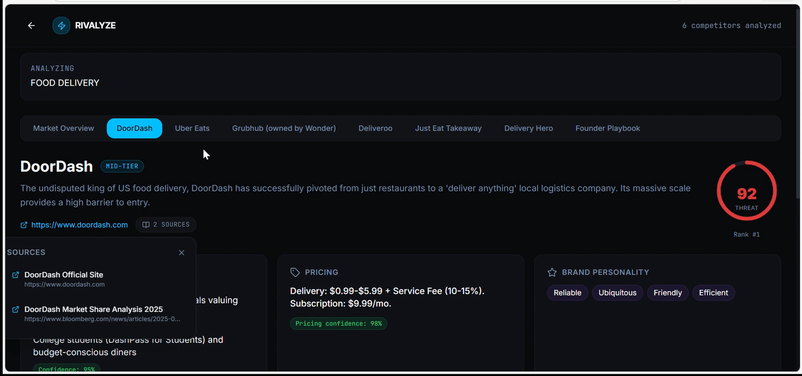

---

## Uber Eats Analysis

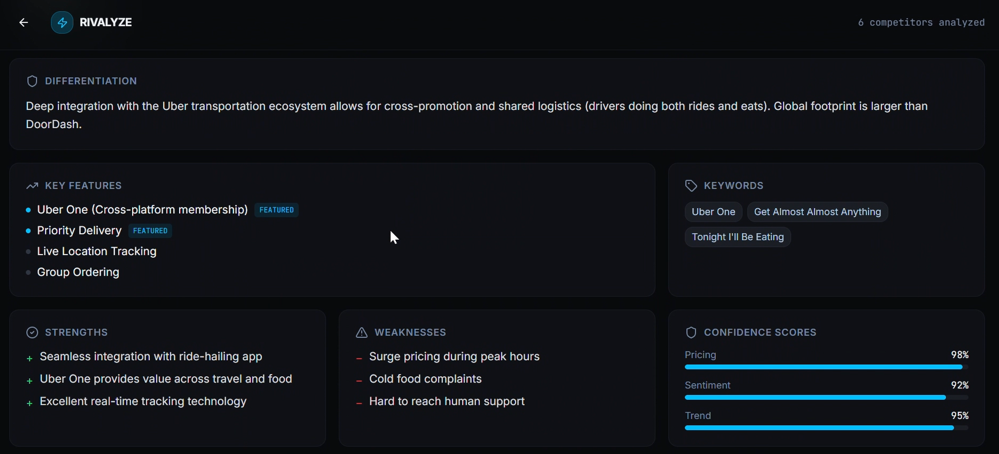

---

## Uber Eats References

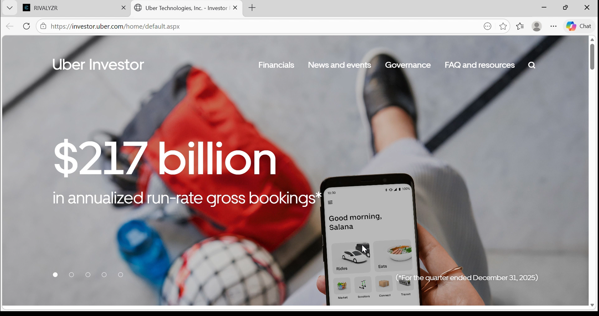

---

## Feature Landscape

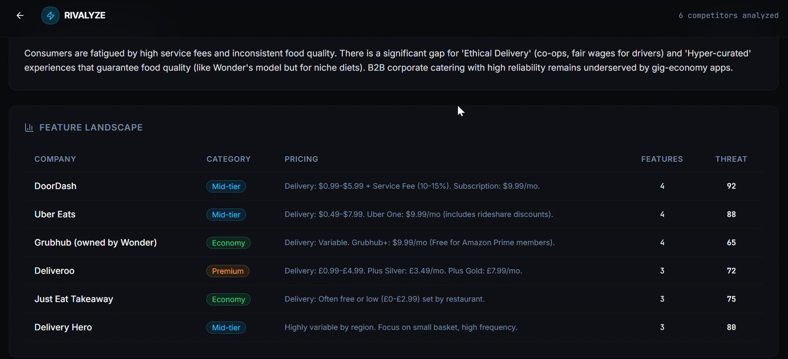

---

## White Space Analysis

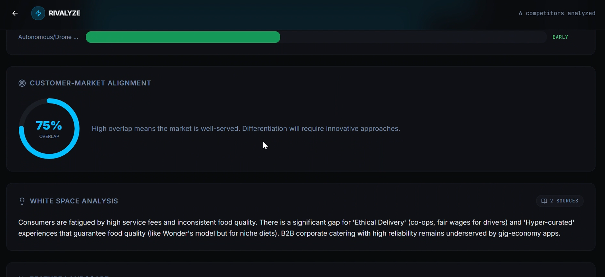

---

# 🎥 Project Demonstration

Watch the complete demo here:

**https://youtu.be/zKywuUwD-74**

---

# 📄 Presentation

The complete project presentation is available in:

```
docs/SNUCHACKS_RIVALYZE_PPT.pptx
```

---

# 🚀 Future Improvements

- Real-time competitor monitoring
- Automated market alerts
- Multi-language review analysis
- AI-generated business reports
- Exportable competitor comparison reports
- Historical trend tracking
- Advanced market forecasting

---

# 📖 Learning Outcomes

Through this project our team explored:

- AI-assisted competitive intelligence
- Prompt engineering
- Website data extraction
- Sentiment analysis
- React application development
- Dashboard design
- Team collaboration during hackathons

---

# 🙏 Acknowledgements

Developed during **SNUCHACKS Hackathon** as a collaborative team project.

Special thanks to the organizers, mentors, and teammates whose contributions made this project possible.

---

## ⭐ If you found this project interesting, consider giving it a star!
